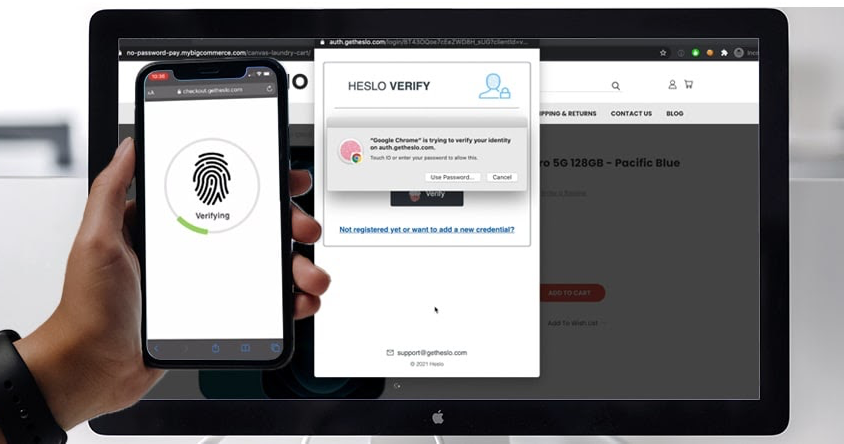
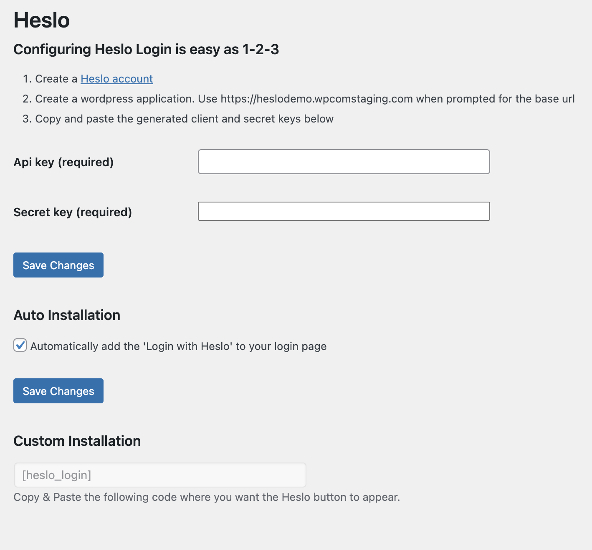

<!-- PROJECT LOGO -->
<br />
<p align="center">


  <h1 align="center">Heslo Login</h1>

  <p align="center">
    For WordPress
    <br />
    <br />
    <a href=" https://github.com/getheslo/login-wordpress-plugin.git/issues">Report Bug</a>
    ·
    <a href=" https://github.com/getheslo/login-wordpress-plugin.git/issues">Request Feature</a>
  </p>
</p>
<!-- TABLE OF CONTENTS -->

<p align="center">

  
  </p>

## Table of Contents

- [Table of Contents](#table-of-contents)
- [About The Project](#about-the-project)
- [Getting Started](#getting-started)
  - [Prerequisites](#prerequisites)
  - [WordPress Setup Guide](#wordpress-setup-guide)
  - [Building From Source](#building-from-source)
- [License](#license)
- [Contact](#contact)


## About The Project

WordPress Plugin to enable a passwordless login experience using Heslo's API. The same technology that powers the popular [Heslo Pay](https://getheslo.com) across e-commerce platforms.

Eliminate the need for users to enter a password when they log in to their website. Heslo Login enables a passwordless login experience using biometrics such as Touch or Face ID. If a device does not support a FIDO authenticator then the user will simple peform an email pin verification

This plugin will add a custom short codes `[heslo_login]`. This short code will generate a login form that will use Heslo's API to authenticate the user without a password.

The user must have a FIDO2 compatible device, otherwise user authentication default to a email pin verification.


<!-- GETTING STARTED -->

## Getting Started

### Prerequisites

As this is a wordpress plugin this project requires wordpress to run.

(OPTIONAL) If you wish to modify the Javascript source files and/or PHP dependancies within this project, then you would also need to nave Node, NPM, and Composer installed.

### WordPress Setup Guide

1. Install the plugin (through the zip file or through the wordpress plugin store)
2. Configure the plugin under Settings > Heslo Login (as shown in the image below)

   

3. Install Heslo Login is as easy as 1-2-3

      1. Create a [Heslo Account](https://dashboard.getheslo.com?redirect_page=applications) - Takes 30 seconds to create one!
      2. Create a wordpress application. Use the base url specified the Wordpress plugin settings.</li>
      3. Copy and paste the generated client and secret keys into your plugin settings.


4. Add `[heslo_login]` to your login page and poosition the Heslo button how you like.
5. Or, select "Auto Installation" to automatically install it to the wordpress login.php page.

### Building From Source

1. Go to your wordpress plugin folder

```sh
cd htdocs/wp-contents/plugins
```

2. Download or clone this repo

```sh
git clone https://github.com/getheslo/login-wordpress-plugin.git
```

3. Open up wordpress and configure the plugin (refer to above)
4. (Optional) Editing javascript. Edit stuff in srcjs and don't edit javascript in includes (its minified and generated from files in srcjs anyway). You'll need nodejs to run though.
5. (Optional) Build your own javascript files

```sh
npm i
npm run develop
```

<!-- Issues -->

## Issues

See the [open issues]( https://github.com/getheslo/login-wordpress-plugin.git/issues) for a list of proposed features (and known issues).

<!-- LICENSE -->

## License

Distributed under the GPLv3 License. See `LICENSE` for more information.

<!-- CONTACT -->

## Contact

Heslo Support - support@getheslo.com

If you need plugin help feel free to contact chris@getheslo.com (usually reply within 24 hours).

Project Link: [https://github.com/getheslo/login-wordpress-plugin.git]( https://github.com/getheslo/login-wordpress-plugin.git)
